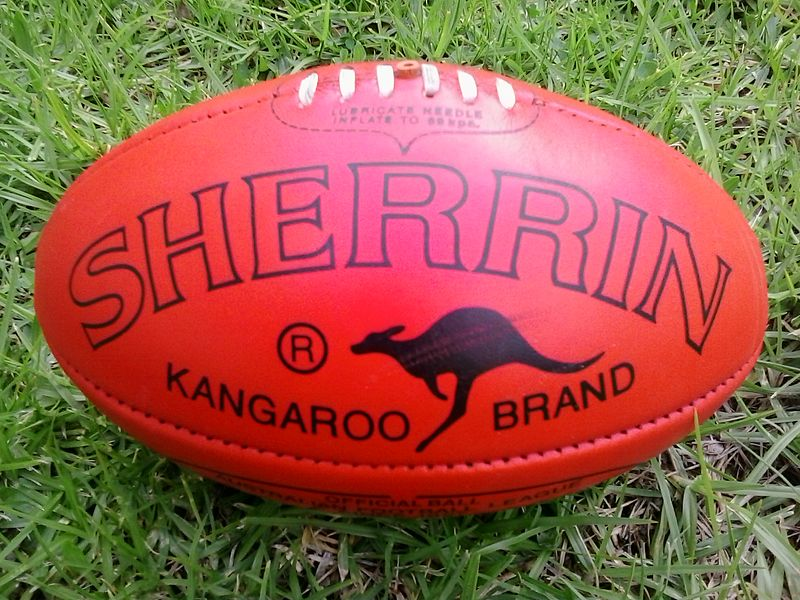

class: inverse middle center big-subsection

```{r setup, include=FALSE, cache=FALSE}
options(htmltools.dir.version = FALSE)
knitr::opts_chunk$set(cache = FALSE, dev = 'svg', echo = FALSE, message = FALSE, warning = FALSE,
                      fig.height=6, fig.width = 1.777777*6)

library('vegan')
library('tibble')
library('mvnfast')
library('dplyr')
library('tidyr')
library('ggplot2')
library('gganimate')
data(varespec, varechem)

## plot defaults
theme_set(theme_minimal(base_size = 16, base_family = 'Fira Sans'))
```

# Welcome

---

# Logistics

## Slides

Slidedeck: [bit.ly/rvegan-webinar](https://bit.ly/rvegan-webinar)
Sources: [github.com/gavinsimpson/intro-vegan-webinar-july-2020](https://github.com/gavinsimpson/intro-vegan-webinar-july-2020)

## Q & A

Add questions to Google Doc: [bit.ly/rvegan-webinar-qa](https://bit.ly/rvegan-webinar-qa)

## Recording

Livestream will be recorded &mdash; link will be emailed to you later today

---

# Today's topics

* Diversity

* Dissimilarity

* Ordination

    * Principal Components Analysis (PCA)
	* Correspondence Analysis (CA)
	* Principal Coordinates Analysis (PCO or PCoA)
	* Non-metric Multidimensional Scaling (NMDS)

* Practical tips for working & plotting ordinations using **vegan**

---

# Webinar on Thursday 9th July

Advanced community ecological data analysis using vegan

Register: https://advanced-vegan-2020.eventbrite.ca

* Constrained ordination

* Permutation testing

---
class: inverse middle center big-subsection

# Diversity

---

# Diversity metrics

**vegan** has many functions for computing diversity metrics

.row[
.col-6[
Three popular ones are

1. Shannon-Weaver

2. Simpson

3. Inverse Simpson

$p_i$ is proportion of species $i$

$b$ is the base, usually $e$

$S$ is number of species (richness)
  
]
.col-6[
$$H = - \sum_{i=1}^{S} p_i \log_b p_i$$

$$D_1 = 1 - \sum_{i=1}^{S} p_i^2$$

$$D_2 = \frac{1}{\sum_{i=1}^{S} p_i^2}$$
]
]

---

# Diversity metrics

```{r diversity-1, echo = TRUE}
data(BCI)
H <- diversity(BCI)
head(H)
D1 <- diversity(BCI, index = "simpson")
head(D1)
D2 <- diversity(BCI, index = "invsimpson", base = 2)
head(D2)
```

---

# Diversity metrics

## Richness

```{r diversity-2, echo = TRUE}
head(specnumber(BCI)) # species richness

head(rowSums(BCI > 0)) # simple
```

## Pielou's Evenness $J$

```{r diversity-3, echo = TRUE}
J <- H / log(specnumber(BCI))
head(J)
```

---

# Diversity &mdash; R&eacute;nyi entropy & Hill's numbers

R&eacute;nyi's *generalized entropy*

$$H_a = \frac{1}{1-a} \log \sum_{i = 1}^{S} p_i^a$$

where $a$ is the *order* of the entropy

Corresponding Hill's numbers are

$$N_a = \exp{(H_a)}$$

---

# Diversity &mdash; R&eacute;nyi entropy & Hill's numbers

```{r diversity-4, echo = TRUE}
R <- renyi(BCI, scales = 2)
head(R)

N2 <- renyi(BCI, scales = 2, hill = TRUE)
head(N2) # inverse simpson
```

---

# Diversity &mdash; R&eacute;nyi entropy & Hill's numbers

```{r diversity-5, echo = TRUE, fig.height = 6, fig.width = 6 * 1.77777, out.width = "80%"}
k <- sample(nrow(BCI), 6)
R <- renyi(BCI[k,])
plot(R)
```

---

# Rarefaction

Species richness increases with sample size (effort)

Rarefaction gives the expected number of species rarefied from $N$ to $n$ individuals

$$\hat{S}_n = \sum_{i=1}^S (1 - q_i) \; \mathsf{where} \; q_i = \frac{\binom{N - x_i}{n}}{\binom{N}{n}}$$

$x_i$ is count of species $i$ and $\binom{N}{n}$ is a binomial coefficient &mdash; the number of ways to choose $n$ from $N$

---

# Rarefaction

.row[
.col-6[
```{r rarefy, echo = TRUE, fig.show = "hide"}
rs <- rowSums(BCI)
quantile(rs)

Srar <- rarefy(BCI, min(rs))
head(Srar)

rarecurve(BCI, sample = min(rs))
```
]

.col-6[
```{r rarefy, echo = FALSE, fig.height = 6, fig.width = 6, dev.args = list(pointsize = 14), results = "hide"}
```
]
]

---
class: inverse middle center big-subsection

# Dissimilarity

---

# Dissimilarity

.row[

.col-6[

```{r dissimilarity, echo = FALSE, fig.width = 6, fig.height = 6, dev.args = list(pointsize = 14)}
plot(1:5, 1:5, type = "n", axes = FALSE, ann = FALSE)
points(c(2,4), c(4,2), col = c("red","blue"), pch = 1:2,
       cex = 2, lwd = 2)
## label points with i and j
text(c(2,4), c(4,2), labels = c("i", "j"),
     adj = c(-1.5,-1.5))
## lable the line of Euclidean distance
text(3,3, labels = expression(d[ij]), adj = c(-1.5,-1.5))
## euclidean distance line
lines(c(2,4), c(4,2), lwd = 2)
## line from points to x axis
lines(c(4,4), c(2,0), lty = "dashed")
lines(c(2,2), c(4,0), lty = "dashed")
## line from points to y axis
lines(c(4,0), c(2,2), lty = "dashed")
lines(c(2,0), c(4,4), lty = "dashed")
## axes
axis(1, at = c(2,4), labels = c(expression(X[i1]),
                       expression(X[j1])))
axis(2, at = c(2,4), labels = c(expression(X[j2]),
                       expression(X[i2])), las = 2)
## titles
title(xlab = "Variable 1", ylab = "Variable 2")
title(main =
      expression(d[ij] == sqrt((X[j1] - X[i1])^2 +
          (X[j2] - X[i2])^2)))
box(bty = "l")
```
]

.col-6[

$$d_{ij} = \sqrt{\sum\limits^m_{k=1}(x_{ik} - x_{jk})^2}$$

$$d_{ij} = \sum\limits^m_{k=1}|x_{ik} - x_{jk}|$$

$$d_{ij} = \frac{\sum\limits^m_{k=1}|x_{ik} - x_{jk}|}{\sum\limits^m_{k=1}(x_{ik} + x_{jk})}$$
]
]

---

# Dissimilarity

Two key functions

1. `vegdist()`
2. `decostand()`

```{r dissimilarity-2, echo = TRUE}
data(varespec)

euc_dij <- vegdist(varespec, method = "euclidean")

bc_dij <- vegdist(varespec)

hell_dij <- vegdist(decostand(varespec, method = "hellinger"),
                    method = "euclidean")
```

---
class: inverse middle center big-subsection

# Ordination

---
class: inverse middle center big-subsection

# ordnung

???

The word "ordination" comes from the German word "ordnung"

---

# Ordination

Putting things in order is exactly what we we do in ordination

* we arrange our samples along gradients by fitting lines and planes through the data that describe the main patterns in those data

* we map data to lower dimensions reflecting how similar the samples are to one another in terms of the variables measured

Three families of models

1. Linear
2. Unimodal
3. Distance-based

---
class: inverse middle center big-subsection

# Unconstrained

---

# Unconstrained

What is .text-higlight[unconstrained]?

First we look for major variation, then relate it to environmental variation

vs. *constrained* ordination, where we only want to see what can be explained by environmental variables of interest

*How well do we explain the main patterns in the species data*? vs *How large are the patterns we can expain with the measured data*?

---

# Ordination methods

Principal Components Analysis (PCA) is a linear method &mdash; most useful for environmental data or sometimes with species data and short gradients

Correspondence Analysis (CA) is a unimodal method &mdash; most useful for species data, especially where non-linear responses are observed

Principal Coordinates Analysis (PCO) and Non-metric Multidimensional Scaling (NMDS) &mdash; can be used for any kind of data

---
class: inverse middle center huge-subsection

# PCA

---

# Principal Components Analysis

Instead of doing many regressions, do one with all the responses

No explanatory variables &mdash; uncover latent, underlying gradients

PCA fits a line through our cloud of data in such a way that it maximises the variance in the data captured by that line (i.e.~minimises the distance between the fitted line and the observations)

Fit a second line to form a plane, and so on, until we have one PCA axis for every dimension of the data

Each of these subsequent axes is uncorrelated with previous axes &mdash; they are .text-highlight[orthogonal] &mdash; the variance each axis explains is uncorrelated

---

# Principal Components Analysis

.center-fig[

]

---

# Principal Components Analysis

```{r pca-animation, cache = TRUE}
## Create Data
set.seed(1)
sig <- matrix(c(1, 0.8, 0.8, 1), byrow = TRUE, ncol = 2)
df <- setNames(as.data.frame(rmvn(200, mu = c(5, 10), sigma = sig)), c("x1", "x2"))
df <- as_tibble(df)

## basic plot
base_plt <- ggplot(df, aes(x = x1, y = x2)) +
    geom_point()

## centre variables and replot
df <- mutate(df,
             x1_c = x1 - mean(x1),
             x2_c = x2 - mean(x2))
base_c_plt <- ggplot(df, aes(x = x1_c, y = x2_c)) +
    geom_point()

## prcomp
pc <- prcomp(df[, c("x1", "x2")])

deg2rad <- function(x) {
    x * pi / 180
}

rad2deg <- function(x) {
    x * 180 / pi
}

R <- function(deg) {
    ang <- deg2rad(deg)
    matrix(c(cos(ang), -sin(ang),
             sin(ang), cos(ang)),
           byrow = TRUE, ncol = 2)
}

rotate <- function(angle, x, y) {
    cbind(x, y) %*% R(angle)
}

project <- function(angle, x, y, axis = 1) {
    x <- max(abs(range(x))) * c(-1,1)
    y <- max(abs(range(y))) * c(-1,1)
    U <- R(angle)
    out <- if (axis == 1) {
        cbind((cbind(x, y) %*% U)[,1, drop = FALSE], 0) %*% t(U)
    } else {
        cbind(0, (cbind(x, rev(y)) %*% U)[,2, drop = FALSE]) %*% t(U)
    }

    out
}

## we want to rotate
rot_angle <- rad2deg(acos(pc$rotation[c(1, 4)]))[2]

## drop first as that is the data
N <- 20
angles <- seq(0, rot_angle, length = N)

rot_data <- lapply(angles, rotate, x = df$x1_c, y = df$x2_c)
pc1_line_data <- lapply(angles, project, x = df$x1_c, y = df$x2_c, axis = 1)
pc2_line_data <- lapply(angles, project, x = df$x1_c, y = df$x2_c, axis = 2)

plt_data <- do.call("rbind", rot_data)
pc1_line_data <- do.call("rbind", pc1_line_data)
pc2_line_data <- do.call("rbind", pc2_line_data)

plt_data <- as.data.frame(plt_data) %>%
    setNames(nm = c("x1", "x2")) %>%
    as_tibble() %>%
    add_column(angle = rep(angles, each = nrow(df)),
               .before = 1)

pc1_line_data <- as.data.frame(pc1_line_data) %>%
    setNames(nm = c("x1", "x2")) %>%
    as_tibble() %>%
    add_column(angle = rep(rev(angles), each = 2),
               .before = 1)

pc2_line_data <- as.data.frame(pc2_line_data) %>%
    setNames(nm = c("x1", "x2")) %>%
    as_tibble() %>%
    add_column(angle = rep(rev(angles), each = 2),
               .before = 1)

ani_plt <- ggplot(plt_data, aes(x = x1, y = x2)) +
    geom_point(colour = "#025196") +
    geom_line(data = pc1_line_data, colour = "#fdb338") +
    geom_line(data = pc2_line_data, colour = "#fdb338") +
    coord_fixed() +
    labs(x = expression(x[1]), y = expression(x[2]))

## constants
anim_width <- 1000
anim_height <- anim_width
anim_dev <- 'png'
anim_res <- 200

pca_anim <- animate(
    ani_plt + transition_states(angle, transition_length = 1, state_length = 0.1),
    nframes = 200, height = anim_height, width = anim_width, res = anim_res, dev = anim_dev)

anim_save('resources/pca-anim.gif', pca_anim)
```

```{r other-pca-plot-stuff}
proj_pc1 <- cbind(pc$x[,1], 0) %*% t(pc$rotation)
proj_pc2 <- cbind(0, pc$x[,2]) %*% t(pc$rotation)

project_pcs <- function(x, y, axis = 1, sol) {
    x <- max(abs(range(x))) * c(-1,1)
    y <- max(abs(range(y))) * c(-1,1)
    U <- sol$rotation
    out <- if (axis == 1) {
        cbind((cbind(x, y) %*% U)[,1, drop = FALSE], 0) %*% t(U)
    } else {
        cbind(0, (cbind(x, rev(y)) %*% U)[,2, drop = FALSE]) %*% t(U)
    }

    out
}

rotate_pcs <- function(x, sol) {
    zapsmall(x %*% sol$rotation)
}

proj_pc1 <- with(df, project_pcs(x1_c, x2_c, axis = 1, sol = pc))
proj_pc2 <- with(df, project_pcs(x1_c, x2_c, axis = 2, sol = pc))
rot_pc1  <- with(df, rotate_pcs(proj_pc1, sol = pc))
rot_pc2  <- with(df, rotate_pcs(proj_pc2, sol = pc))

## compute prinicpal component in both coord systems
pcs <- add_column(as_tibble(rbind(proj_pc1, proj_pc2)),
                  pc = rep(1:2, each = 2), .before = 1)
pcs_rot <- as_tibble(rbind(rot_pc1, rot_pc2)) %>%
    setNames(nm = c("x1", "x2")) %>%
    add_column(pc = rep(1:2, each = 2), .before = 1)

## rotate data
df_rot <- as_tibble(pc$x) %>%
    setNames(nm = c("x1_c", "x2_c")) %>%
    mutate(x1_c = -x1_c)

## basic plot
base_plt <- ggplot(df, aes(x = x1, y = x2)) +
    geom_point(size = 1.1)

## centre variables and replot
df <- mutate(df,
             x1_c = x1 - mean(x1),
             x2_c = x2 - mean(x2))
base_c_plt <- ggplot(df, aes(x = x1_c, y = x2_c)) +
    geom_point(size = 1.1)

base_c_pc_plt <- ggplot(df, aes(x = x1_c, y = x2_c)) +
    geom_vline(xintercept = 0, colour = "grey") +
    geom_hline(yintercept = 0, colour = "grey") +
    geom_point(size = 1.1) +
    coord_fixed() +
    geom_line(data = pcs, aes(x = x1, y = x2, group = pc), colour = "#025196")

base_pc_plt <- ggplot(df_rot, aes(x = x1_c, y = x2_c)) +
    geom_point(size = 1.1) +
    coord_fixed() +
    geom_line(data = pcs_rot, aes(x = x1, y = x2, group = pc))
```

.row[
.col-4[
```{r pc-anim-plt1, fig.width = 6, fig.height = 6}
ggplot(df, aes(x = x1_c, y = x2_c)) +
    geom_vline(xintercept = 0, colour = "black", size = 1.5) +
    geom_hline(yintercept = 0, colour = "black", size = 1.5) +
    geom_point(size = 2, colour = "#025196") +
    coord_fixed() +
    labs(title = "Centre variables", x = expression(x[1] - bar(x)[1]),
         y = expression(x[2] - bar(x)[2])) +
    theme_minimal(base_size = 22, base_family = 'Fira Sans')
```
]
.col-4[
```{r pc-anim-plt2, fig.width = 6, fig.height = 6}
ggplot(df, aes(x = x1_c, y = x2_c)) +
    geom_vline(xintercept = 0, colour = "black", size = 1.5) +
    geom_hline(yintercept = 0, colour = "black", size = 1.5) +
    geom_point(size = 2, colour = "#025196") +
    coord_fixed() +
    geom_line(data = pcs, aes(x = x1, y = x2, group = pc), colour = "#fdb338", size = 1.5) +
    labs(title = "Find directions", x = expression(x[1] - bar(x)[1]),
         y = expression(x[2] - bar(x)[2])) +
    theme_minimal(base_size = 22, base_family = 'Fira Sans')
```
]
.col-4[
```{r pc-anim-plt3, fig.width = 6, fig.height = 6}
ggplot(df_rot, aes(x = x1_c, y = x2_c)) +
    geom_point(size = 2, colour = "#025196") +
    coord_fixed() +
    geom_line(data = pcs_rot, aes(x = x1, y = x2, group = pc), colour = "#fdb338", size = 1.5) +
    labs(title = "Rotate", x = "PC1", y = "PC2") +
    theme_minimal(base_size = 22, base_family = 'Fira Sans')
```
]
]


---

# Principal Components Analysis


.center[]

---

# Load vegan

**vegan** is an add-on package

```{r loading-1, eval = FALSE, echo = TRUE}
## install.packages("vegan") # Only need if you've never installed before
library("vegan")
data(varespec)
data(varechem)
```

**vegan** comes with a number of data sets which we'll use to get started

---

# Vegetation in lichen pastures &mdash; species

```{r loading-2, echo = TRUE}
class(varespec)
dim(varespec)                               # number of samples, species
head(varespec[,1:6], n = 5)
```

`varespec` is a data frame

* *Variables* are the columns (here the species)
* *Observations* are the rows (the samples, sites, etc)

???

Data are cover values of 44 understorey species recorded at 24 locations in lichen pastures within dry *Pinus sylvestris* forests

This arrangement is back-to-front if you are used to OTU like data

---

# Vegetation in lichen pastures &mdash; chemistry

Also have associated soil physical and chemical measurements at the `r nrow(varespec)` sites

```{r loading-3, echo = TRUE}
head(varechem)
```

???

`Baresoil` is the estimated cover of bare soil
`Humdepth` is the depth of humus layer

---

# Vegetation in lichen pastures &mdash; PCA

PCA is fitted using `rda()`

* Provide a data frame of observations on one or more variables
* To scale all variables to be &mu; = 0, &sigma;<sup>2</sup> = 1: `scale = TRUE`

```{r vare-pca-1, echo = TRUE}
pca <- rda(decostand(varespec, method = "hellinger"), scale = TRUE)
pca
```

---

# Vegetation in lichen pastures &mdash; PCA

PCA of the covariance matrix &mdash; default is `scale = FALSE`

```{r vare-pca-1b, echo = TRUE}
rda(decostand(varespec, method = "hellinger"), scale = FALSE)
```

How **vegan** scales the eigenvalues is different to *Canoco*

---


# Vegetation in lichen pastures &mdash; PCA

```{r vare-pca-1c, echo = TRUE, out.width = "95%", dev.args = list(pointsize = 14)}
biplot(pca, scaling = "symmetric")
```

---

# PCA biplots

.row[
.col-6[
* Sample (species) points plotted close together have similar species compositions (occur together)
* In PCA, species scores often drawn as arrows &mdash; point in direction of increasing abundance
* Species arrows with small angles to an axis are highly correlated with that axis
]
.col-6[

```{r vare-pca-2, echo=TRUE, fig.width=6, fig.height=6}
biplot(pca, scaling = "symmetric")
```
]
]

---

# Eigenvalues &lambda;

.row[
.col-6[

Eigenvalues are the amount of variance (inertia) explained by each axis

```{r vare-pca-3, echo = TRUE}
head(eigenvals(pca), 5)
```
]
.col-6[
```{r vare-pca-4, echo = TRUE, dev.args = list(pointsize = 14), fig.height = 6, fig.width = 6}
screeplot(pca, bstick = TRUE, type = "l",
          main = NULL)
```
]
]

---

# Eigenvalues &lambda;

The `summary()` method provides additional information

```{r vare-pca-5, echo = TRUE}
summary(eigenvals(pca))
```

---
class: inverse middle center subsection

# Correspondence Analysis

---

# Correspondence Analysis

Correspondence analysis (CA) is very similar to PCA &mdash; a weighted form of PCA

The row and column sums are used as weights and this has the effect of turning the analysis into one of relative composition

The weighting is a trick to get linear-based software to fit non-linear responses

These nonlinear response are assumed to unimodal Gaussian curves, all with equal height and tolerance widths, and equally spaced optima

---

# Correspondence Analysis

```{r}
gaussresp <- function(x,u) { exp(-(x-u)^2/2) }
n_opt <- 20
x <- seq(0, 6, length = 100) ## The gradient
u <- seq(-2, 8, len = n_opt) ## The optima
pack <- outer(x, u, gaussresp)
pack <- as.data.frame(pack) %>%
    setNames(nm = paste0("spp", seq_len(n_opt))) %>%
    as_tibble() %>%
    add_column(x = x, .before = 1) %>%
    pivot_longer(cols = -x, names_to = "species", values_to = "abundance")

ggplot(pack, aes(x = x, y = abundance, colour = species)) +
    geom_line() +
    theme(legend.position = "none") +
    labs(x = "Gradient", y = "Abundance")
```

---

# Correspondence Analysis

Correspondence analysis (CA) is very similar to PCA &mdash; a weighted form of PCA

The row and column sums are used as weights and this has the effect of turning the analysis into one of relative composition

The weighting is a trick to get linear-based software to fit non-linear responses

These nonlinear response are assumed to unimodal Gaussian curves, all with equal height and tolerance widths, and equally spaced optima

So, not very realistic, but it is surprisingly robust at times to violation of this assumption

---

# Vegetation in lichen pastures &mdash; CA biplots

.row[
.col-7[
- Have two sets of scores
    1. Species scores
    2. Site scores
- Sample (species) points plotted close together have similar species compositions (occur together)
- In CA, species scores drawn as points &mdash; this is the fitted optima along the gradients
- Abundance of species declines in concentric circles away from the optima
]
.col-5[

```{r vare-ca-1, echo=TRUE, fig.width=6, fig.height=6, dev.args = list(pointsize = 14)}
ca <- cca(varespec)
plot(ca)
```

]
]

---

# Vegetation in lichen pastures &mdash; CA biplots

- Species scores plotted as weighted averages of site scores, or
- Site scores plotted as weighted averages of species scores, or
- A symmetric plot

```{r vare-ca-2, echo = FALSE, fig.show = "hold", fig.height = 11/2.75, fig.width = 11, dev.args = list(pointsize = 14)}
layout(matrix(1:3, ncol = 3))
plot(ca, scaling = "species", main = "scaling = \"species\"")
plot(ca, scaling = "sites", main = "scaling = \"sites\"")
plot(ca, scaling = "symmetric", main = "scaling = \"symmetric\"")
layout(1)
```

---
class: inverse middle center huge-subsection

# vegan

---

# Vegan basics

- The majority of vegan functions work with a single vector, or more commonly an entire data frame
- This data frame may contain the species abundances
- Where subsidiary data is used/required, these two are supplied as data frames
- For example; the environmental constraints in a CCA
- It is not a problem if you have all your data in a single file/object; just subset it into two data frames after reading it into R

```{r vegan_subset, eval=FALSE, echo = TRUE}
spp <- allMyData[, 1:20] ## columns 1-20 contain the species data
env <- allMyData[, 21:26] ## columns 21-26 contain the environmental data
```

---
<!--
# Simple vegan usage

First we start with a simple correspondence analysis (CA) to illustrate the basic features

Here I am using one of the in-built data sets on lichen pastures

For various reasons to fit a CA we use the `cca()` function

Store the fitted CA in `ca1` and print it to view the results

```{r ca_1_vegan, echo = TRUE}
ca1 <- cca(varespec)
ca1
```

--- 
-->

# `scores()` & `scaling`

- When we draw the results of many ordinations we display 2 or more sets of data
- Can't display all of these and maintain relationships between the scores
- Solution; scale one set of scores relative to the other
- Controlled via the `scaling` argument

---

# Scaling

How we scale scores is controlled via the `scaling` argument

- `scaling = 1` &mdash; Focus on sites, scale site scores by $\lambda_i$
- `scaling = 2` &mdash; Focus on species, scale species scores by $\lambda_i$
- `scaling = 3` &mdash; Symmetric scaling, scale both scores by $\sqrt{\lambda_i}$
- `scaling = -1` &mdash; As above, but for `rda()` get correlation scores
- `scaling = -2` &mdash; for `cca()` multiply results by $\sqrt{(1/(1-\lambda_i))}$
- `scaling = -3` &mdash; this is Hill's scaling
- `scaling < 0` &mdash; For `rda()` divide species scores by species' $\sigma$
- `scaling = 0` &mdash; raw scores

---

# No one can remember all that&hellip;

Use the text names instead:

* `scaling = "none"` means `scaling = 0`
* `scaling = "sites"` means `scaling = 1`
* `scaling = "species"` means `scaling = 3`
* `scaling = "symmetric"` means `scaling = 3`

For PCA (`rda()`) use `correlation = TRUE` to get the correlation scores (negative scaling)

For CA (`cca()`)  use `hill = TRUE` to get Hill's scaling scores (negative scaling)

---

# Extractor functions &mdash; scores()

Don't rummage around in the objects returned by *vegan* functions &mdash; unless you know what you're doing

```{r scores-eg, echo = TRUE}
head(scores(pca, choices = 1:3, display = "species", scaling = "species", correlation = TRUE))
```

---

# Basic ordination plots &mdash; plot()

.row[
.col-6[
- `choices = 1:2` &mdash; which axes?
- `scaling = 3` &mdash; scaling to use
- `display = c("sites","species")` &mdash; which scores (default is both)
- `type = "text"` &mdash; display scores using labels or points (`"points"`)
- Other graphics arguments can be supplied but apply to all scores
]

.col-6[

```{r ca_biplot, fig.width=8, fig.height=8, echo = TRUE, dev.args = list(pointsize = 14)}
plot(ca1, choices = c(1,3),
     scaling = "symmetric")
```

]
]

---
class: inverse center middle subsection

# Distance-based methods

---
class: inverse center middle huge-subsection

# PCO

---

# Principal Coordinates Analysis

PCoA (or PCO, or **metric** multidimensional scaling (MDS)) finds a mapping to Euclidean space of $n$ objects using the $n$ by $n$ matrix of dissimilarities $d_{ij}$

PCoA is an eigen decomposition like PCA

* first axis is the best 1D mapping of the dissimilarities
* subsequent axes are orthogonal to the first, but improve the mapping by smaller & smaller amounts

Can use *any* dissimilarity coefficient (with a big **but**)

PCoA on a Euclidean distance matrix &#8680; PCA (without species scores)

---

# Principal Coordinates Analysis

The big **but** is that not all dissimilarity coefficients can be represented in Euclidean space

If dissimilarity matrix is metric we're OK &mdash; *usually*

If not metric, get negative eigenvalues &#8680; correspond to distances in imaginary space

Distortion can be measured as

$$\frac{\sum \left | \lambda^{-} \right |}{\sum \left | \lambda \right |}$$

---

# PCoA &mdash; correcting negative &lambda;

1. Could square root transform the $d_{ij}$

2. Add a sufficiently large constant to $d_{ij}$ or $d_{ij}^2$

    * **Lingoes** method: $\hat{d}_{ij} = \sqrt{d_{ij}^2 + 2c_1}$ for $i \neq j$

        where $c_1$ is $\mathsf{max} \left ( \left | \lambda_i^{-} \right | \right )$

    * **Cailliez** method: $\hat{d}_{ij} = d_{ij} + c_2$ for $i \neq j$
	
	    where $c_2$ is computed from a special matrix formed during the PCoA calculations

---

# Principal Coordinates Analysis

Default dissimilarity in `vegdist()` is Bray-Curtis

```{r pco-example, echo = TRUE}
pco1 <- wcmdscale(vegdist(varespec), eig = TRUE)
round(eigenvals(pco1), 3)
pco2 <- wcmdscale(vegdist(varespec), eig = TRUE, add = "lingoes")
round(eigenvals(pco2), 3)
```

*Note there's one fewer dimensions after correction*

---

# Principal Coordinates Analysis

Can plot the PCoA using `plot()` and add *species scores*

.row[
.col-6[
```{r pco-example-2, echo = TRUE, fig.show = "hide"}
pco <- wcmdscale(vegdist(varespec), eig = TRUE)

## plot
plot(pco)

## get PCoA scores
scrs <- scores(pco, choices = 1:2)

## take WA of PCoA scores,
## weight by abundance
spp_scrs <- wascores(scrs, varespec,
                     expand = FALSE)

## add
points(spp_scrs, col = "red", pch = 19)
```
]
.col-6[
```{r pco-example-2, echo = FALSE, fig.width = 6, fig.height = 6, dev.args = list(pointsize = 14)}
```
]
]

---
class: inverse center middle huge-subsection

# NMDS

---

# Non-Metric Multidimensional Scaling

NMDS find a low-dimensional mapping that preserves as best as possible the .text-highlight[rank order] of the original dissimilarities $d_{ij}$

Solution with minimal `stress` is sought; a measure of how well the NMDS mapping fits the $d_{ij}$

Stress is sum of squared residuals of monotonic regression between distances in NMDS space, $d^{*}_{ij}$, & $d_{ij}$

Non-linear regression can cope with non-linear responses in species data

Iterative solution; *convergence is not guaranteed*

Must solve separately different dimensionality solutions

---

# Non-Metric Multidimensional Scaling

- Use an appropriate dissimilarity metric that gives good gradient separation `rankindex()`, e.g Bray-Curtis, Jaccard, Kulczynski
- Wisconsin transformation useful; Standardize species to equal maxima, then sites to equal totals `wisconsin()`
- Use many random starts and look at the fits with lowest stress (`try` & `trymax`
- Only conclude solution reached if lowest stress solutions are similar (Procrustes rotation)
- Fit NMDS for 1, 2, 3, &hellip; dimensions; stop after a sudden drop in stress observed in a screeplot
- NMDS solutions can be rotated ; common to rotate to PCs
- Also scale axes in half-change units

???

Half-change units: samples separated by a distance of 1 correspond, on average, to a 50% turnover in composition

---

# NMDS in vegan

**vegan** implements all these ideas via the `metaMDS()` wrapper

```{r nmds1, echo = TRUE}
data(dune)
set.seed(10)
(sol <- metaMDS(dune, trace = FALSE))
```

---

# NMDS in vegan

If no convergent solutions, continue iterations from previous best solution

```{r nmds2, echo = TRUE}
(sol <- metaMDS(dune, previous.best = sol, trace = FALSE))
```

---

# NMDS in vegan

```{r nmds3, echo = TRUE, eval = FALSE}
layout(matrix(1:2, ncol = 2))
plot(sol, main = "Dune NMDS plot"); stressplot(sol, main = "Shepard plot")
layout(1)
```
```{r nmds3, fig.width=10, fig.height=5, eval = TRUE, dev.args = list(pointsize = 14)}
```

???

Shepard diagram which is a plot of ordination distances and monotone or linear fit line against original dissimilarities.  In addition, it displays two correlation-like statistics on the goodness of fit in the graph. The nonmetric fit is based on stress S and defined as R2 = 1-S*S. The “linear fit” is the squared correlation between fitted values and ordination distances. For monoMDS, the “linear fit” and R2 from “stress type 2” are equal.

---

# Checking dimensionality *k*

Fit NMDS solutions for a number of `k`

.row[
.col-6[
```{r nmds-scree, echo = TRUE}
k_vec <- 1:10
stress <- numeric(length(k_vec))
dune_dij <- metaMDSdist(dune, trace = FALSE)
set.seed(25)
for(i in seq_along(k_vec)) {
    sol <- metaMDSiter(dune_dij, k = i,
                       trace = FALSE)
    stress[i] <- sol$stress
}
```

Need to use the helper functions to do this right

```{r plot_nmds-scree, echo = TRUE, fig.show = "hide"}
plot(k_vec, stress, type = "b", ylab = "Stress",
     xlab = "Dimensions")
```

]
.col-6[
```{r plot_nmds-scree, fig.width = 6, fig.height = 6, dev.args = list(pointsize = 14)}
```
]
]

---

# NMDS &mdash; Goodness of fit

A goodness of fit statistic $g_i$ can be computed for the observations; defined such that $\sum_{i=1}^{n} g_i^2 = S^2$

```{r goodness-nmds, echo = TRUE}
(g <- goodness(sol))
sum(g^2)
sol$stress^2
all.equal(sqrt(sum(g^2)), sol$stress)
```

---

# Supplementary data

If we have other data collected at the same sites, say about the environment, we can investigate relationships between the main components of variation in species composition and those environmental variables

Two main **vegan** functions for this

1. `envfit()` and helpers `vectorfit()` and `factorfit()`

2. `ordisurf()`

`envfit()` fits vectors or planes while `ordisurf()` fits smooth, potentially non-linear surfaces

---

# Vector fitting

`envfit()` fits vectors using a regression

$$\hat{y_i} = \beta_1 x_{1i} + \beta_2 x_{2i} + \cdots \beta_p x_{pi}$$

where:

* $x_{pi}$ are the site scores for the $i$<sup>th</sup> site on axis 1, 2, &hellip;, $p$
* Usually $p = 2$ as we're fitting vectors into 2D ordination plots
* $y_i$ is the value of the environment at the $i$<sup>th</sup> site
* `envfit()` can handle a matrix of environmental variables

*Note no intercept; internally center $\boldsymbol{y}$ and $\boldsymbol{x_p}$*

For categorical $\boldsymbol{y}$, `envfit()` finds averages of scores for each level of the category

---

# Vector fitting

.row[
.col-6[

`envfit()` with formula

```{r envfit-1, echo = TRUE, results = "hide"}
set.seed(42)
ev <- envfit(pca ~ ., data = varechem,
             choices = 1:2,
             scaling = "symmetric",
             permutations = 1000)
ev
```

or data frames

```{r envfit-2, echo = TRUE, results = "hide"}
envfit(pca, varechem,
       choices = 1:2, scaling = "symmetric",
       permutations = 1000)
```
]

.col-6[
```{r envfit-1, echo = FALSE}
```
]
]

---

# Vector fitting

.row[
.col-6[
Values in `PC1` etc are *direction cosines* for vectors of unit length

`r2` is the squared correlation, $R^2$, between $\boldsymbol{y}$ and projection of axis scores on to the vector

For factors is $R^2 = 1 - \mathsf{SS_{W}} / \mathsf{SS_{T}}$

Permutation test shuffles the $\boldsymbol{y}$ to generate distribution of $R^2$ under H<sub>0</sub>
]

.col-6[
```{r envfit-1, echo = FALSE}
```
]
]

---

# Vector fitting

.row[
.col-6[
```{r plot-envfit-1, fig.show = "hide", echo = TRUE}
plot(ev, add = FALSE) # oops bug!
```
]

.col-6[
```{r plot-envfit-1, fig.width = 6, fig.height = 6, dev.args = list(pointsize = 14)}
```
]
]

---

# Vector fitting

.row[
.col-6[
```{r plot-envfit-2, echo = TRUE, fig.show = "hide"}
plot(pca, display = "sites", type = "n",
     scaling = "symmetric")
points(pca, display = "sites",
       scaling = "symmetric")
plot(ev, add = TRUE)
```
]

.col-6[
```{r plot-envfit-2, fig.width = 6, fig.height = 6, dev.args = list(pointsize = 14)}
```
]
]

---

# Smooth surfaces

`envfit()` fitted vectors, linear planes, to ordinations.

`ordisurf()` fits smooth surfaces using a GAM via package **mgcv**

$$\hat{y_i} = f(x_{1i}, x_{2i})$$

where $f()$ is a *bivariate* smooth function of a pair of axis scores $x_{1i}$ and $x_{2i}$

`ordisurf()` exposes a lot of functionality from `mgcv::gam()` and the smooths it can fit

---

## Smooth surfaces

Fitting a 10 basis function isotropic surface

.row[
.col-6[

```{r ordisurf-1, echo = TRUE, fig.show = "hide"}
surf <- ordisurf(pca ~ Ca,
                 data = varechem,
                 knots = 10,
                 isotropic = TRUE,
                 main = NULL)
```

`ordisurf()` plots by default

`surf` contains the fitted `gam()` model
]

.col-6[
```{r ordisurf-1, echo = FALSE, fig.width = 6, fig.height = 6, dev.args = list(pointsize = 14)}
```
]
]

---

# Smooth surfaces

```{r ordisurf-2, echo = TRUE}
summary(surf)
```

---
class: inverse middle center big-subsection

# plotting

---

# Better plotting

Ordination diagrams are often messy &mdash; `plot()` methods designed to get a quick plot of results

To produce better plots you need to know some base graphics skills *and* make use of some *vegan* helpers

---

# Points and labels

`ordipointlabel()` can draw points and labels

.row[
.col-6[

```{r ordipointlabel-1, echo = TRUE, fig.show = "hide"}
set.seed(10)
ordipointlabel(pca,
               display = "sites",
               scaling = "symmetric")
```

Iteratively finds space to draw labels so they don't overplot

]
.col-6[
```{r ordipointlabel-1, fig.height = 6, fig.width = 6, dev.args = list(pointsize = 14)}
```
]
]

---

# Points and labels

`ordipointlabel()` can also add to an existing plot

.row[
.col-6[

```{r ordipointlabel-2, echo = TRUE, fig.show = "hide"}
plot(pca, display = "sites",
     scaling = "symmetric", type = "n")
points(pca, display = "sites",
       scaling = "symmetric", pch = 19,
       col = "#025196")
set.seed(10)
ordipointlabel(pca,
               display = "sites",
               scaling = "symmetric",
               add = TRUE)
```

]
.col-6[
```{r ordipointlabel-2, fig.height = 6, fig.width = 6, dev.args = list(pointsize = 14)}
```
]
]

---

# Points and labels

`ordipointlabel()` can also add to an existing plot

.row[
.col-6[

```{r ordipointlabel-3, echo = TRUE, fig.show = "hide"}
disp <- "species"
scl <- "symmetric"
plot(pca, display = disp,
     scaling = scl, type = "n")
points(pca, display = disp,
       scaling = scl, pch = 19,
       col = "#025196")
set.seed(10)
ordipointlabel(pca,
               display = disp,
               scaling = scl,
               add = TRUE)
```

]
.col-6[
```{r ordipointlabel-3, fig.height = 6, fig.width = 6, dev.args = list(pointsize = 14)}
```
]
]

---

# Points and labels

How successful `ordipointlabel()` is depends on how much you plot & how big you plot it

.row[
.col-6[

```{r ordipointlabel-4, echo = TRUE, fig.show = "hide"}
disp <- c("sites", "species")
scl <- "symmetric"
plot(pca, display = disp,
     scaling = scl, type = "n")
points(pca, display = disp[1],
       scaling = scl, pch = 19,
       col = "#025196")
points(pca, display = disp[2],
       scaling = scl, pch = 19,
       col = "#fdb338")
set.seed(10)
ordipointlabel(pca,
               display = disp,
               scaling = scl,
               add = TRUE,
               col = c(1,1), cex = c(0.7, 0.7))
```

]
.col-6[
```{r ordipointlabel-4, fig.height = 6, fig.width = 6, dev.args = list(pointsize = 14)}
```
]
]

---

# Building up by layers

With base graphics you are in control of *everything*

.row[
.col-6[

```{r layer-plot-1, echo = TRUE, fig.show = "hide"}
data(dune, dune.env)
col_vec <- c("red", "blue", "orange", "grey")
disp <- "sites"
scl <- "symmetric"

ord <- rda(decostand(dune, method="hellinger"))

plot(ord, type = "n", scaling = scl,
     display = disp)
cols <- with(dune.env, col_vec[Management])
points(ord, display = disp, scaling = scl,
       pch = 19, col = cols, cex = 2)
lvl <- with(dune.env, levels(Management))
legend("topright", legend = lvl,
       bty = "n", col = col_vec, pch = 19)
```

]
.col-6[
```{r layer-plot-1, fig.height = 6, fig.width = 6, dev.args = list(pointsize = 14)}
```
]
]

---

# Other utilities &mdash; `ordihull()`

Convex hulls around groups of data

.row[
.col-6[

```{r hull-1, echo = TRUE, fig.show = "hide"}
disp <- "sites"
scl <- "symmetric"

plot(ord, type = "n", scaling = scl,
     display = disp)
ordihull(ord, groups = dune.env$Management,
         col = col_vec,
         scaling = scl, lwd = 2)
ordispider(ord, groups = dune.env$Management,
           col = col_vec,
           scaling = scl, label = TRUE)
points(ord, display = disp, scaling = scl,
       pch = 21, col = "red", bg = "yellow")
```

]
.col-6[
```{r hull-1, fig.height = 6, fig.width = 6, dev.args = list(pointsize = 14)}
```
]
]

---

# Other utilities &mdash; `ordiellipse()`

Draws ellipsoid hulls & standard error & deviation ellipses

.row[
.col-6[

```{r ellipse-1, echo = TRUE, fig.show = "hide"}
disp <- "sites"
scl <- "symmetric"

plot(ord, type = "n", scaling = scl,
     display = disp)
## ellipsoid hull
ordiellipse(ord, groups = dune.env$Management,
            kind = "ehull", col = col_vec,
            scaling = scl, lwd = 2)
## standard error of centroid  ellipse
ordiellipse(ord, groups = dune.env$Management,
            draw = "polygon", col = col_vec,
            scaling = scl, lwd = 2)
ordispider(ord, groups = dune.env$Management,
           col = col_vec,
           scaling = scl, label = TRUE)
points(ord, display = disp, scaling = scl,
       pch = 21, col = "red", bg = "yellow")
```

]
.col-6[
```{r ellipse-1, fig.height = 6, fig.width = 6, dev.args = list(pointsize = 14)}
```
]
]

---

# Any love for *ggplot*?

The **ggvegan** package is in development

.row[
.col-6[
```{r ggvegan, echo = TRUE, fig.show = "hide"}
## library('remotes')
## install_github("gavinsimpson/ggvegan")
library('ggvegan')
library('ggplot2')

autoplot(ord)
```
]

.col-6[
```{r ggvegan, echo = FALSE, fig.height = 6, fig.width = 6, dev.args = list(pointsize = 14)}
```
]
]

---

# Any love for *ggplot*?

The **ggvegan** package is in development

.row[
.col-6[
```{r ggvegan-2, echo = TRUE, fig.show = "hide"}
ford <- fortify(ord, axes = 1:2)
## not yet a tibble
head(ford, 4)

blue <- "#025196"
filter(ford, Score == "sites") %>%
    ggplot(aes(x = PC1, y = PC2)) +
    geom_hline(yintercept = 0, colour = blue) +
    geom_vline(xintercept = 0, colour = blue) +
    geom_point() +
    coord_fixed()
```
]

.col-6[
```{r ggvegan-2, echo = FALSE, fig.height = 6, fig.width = 6, dev.args = list(pointsize = 14), results = "hide"}
```
]
]

---

# Acknowledgments

.row[

.col-6[

### Funding

.center[]
]

.col-6[

### Fellow vegan maintainers

Jari Oksanen

P&eacute;ter S&oacute;lymos

]

]

### Slides

* HTML Slide deck [bit.ly/rvegan-webinar](https://bit.ly/rvegan-webinar) &copy; Simpson (2020) [](http://creativecommons.org/licenses/by/4.0/)
* RMarkdown [Source](https://github.com/gavinsimpson/intro-vegan-webinar-july-2020)
